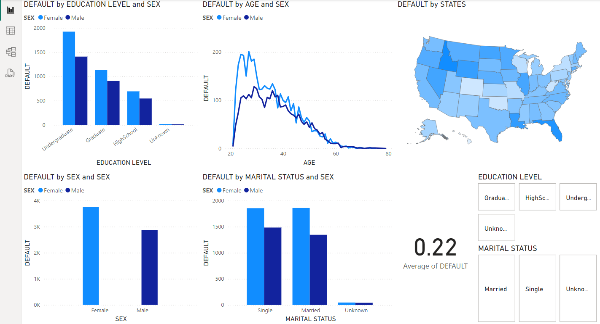

# Credit Card Data Analysis Using Power BI

This project is my attempt to learn and create an analysis on credit card dataset using Power BI. The main focus will be on importing, transforming, and visualising the dataset on credit card defaults. 

### Steps-

* The dataset is available on UCI Machine Learning Repository.
* Fixing the column names:
    * In this dataset, converted the row 2 as the column name, as it gives much clearer understanding of the data instead of pre-existing names.
    * Rename the second last column to DEFAULT, and the last column to STATES.
    * Commited the changes to the data by pressing on close and apply.
* Transforming the dataset:
    * Convert the values in the sex coloumn with 1 to Male and 2 as Female respectively. Going to replace values option and firstly replacing the values as mentioned before. (Here ensure the datatype is changed to 'text' from 'whole number' to replacce the numbers).
    * Similarly converted the categorical data from Education column respectively by adding a new column with conditional column option.
    * Same steps taken as the previous one for the Marriage column.
* Default by Education Level:
    * Select the 'Default' option from the Fields Tab. Drag the 'Education Level' from Fields tab and drop it to axis. We can use gender as a legend, so drag and drop the 'Sex' option to the legend.
    * Similar to the previous step, another chart is created for the 'Default' according to the 'Age' and 'Sex', and converted into a line graph.
    * Finally, one more chart is created for the 'Default' based on just the gender.
* Default by Geolocation:
    * Turned on an option for 'Shape Map' option by going to the option and setting menu and selecting -> Shape Map visual, available in the Preview feature tab, and restarting the app to enable the option for visualization.
    * Selecting the 'Shape Map' option. Dragging the 'States' option for the location and color saturating each state according to the 'Default'.
* Defaulter Ratio and Slicing Data:
    * Created a 'Default' chart based on 'Marital Status' and 'Sex'.
    * Went to the 'Card' chart. Selected the 'Default' option. In the fields menu, went to the drag-drop button and changed the data recording for the 'Card' chart from sum to avg.
    * Added a 'Slicer' chart for the Education Level to get a better understanding. This gave us an extra dimension to look at data, as previously there was not an option to look at just the one particular type of data, let's say for Graduates, there was no option to look at both the male and female graduates together because the data is catgorical. With the help of slicer, this hurdle can be crossed easily.
    * Similarly, created a slicer for the 'Marital Status'.

##### A look at the final view of how the reports are looking
